# Lab9Web

## Membuat PHP Modular

### Persiapan
1. Menjalankan MySQL Server dari menu XAMPP Contol, seperti yang sudah dicontohkan pada praktikum Lab8Web.
2. Menyiapkan text editor VSCode.
3. Membuat folder baru dengan nama lab9_php_modular pada docroot webserver (htdocs).

### Langkah-Langkah Praktikum
#### Membuat Header
Buat file baru dengan nama `header.php` dan masukan kode berikut.

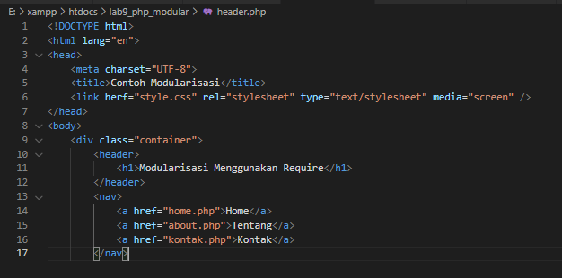

Kemudian untuk mengakses direktory tersebut pada web server dengan mengakses URL:
`http://localhost/lab9_php_modular/header.php`

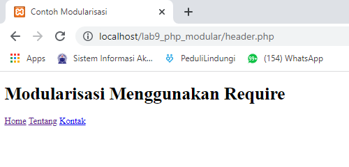

#### Membuat Footer
Buat file baru dengan nama `footer.php` dan masukan kode berikut.

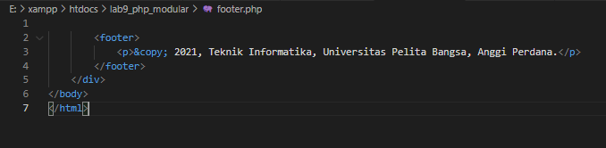

Kemudian untuk mengakses direktory tersebut pada web server dengan mengakses URL:
`http://localhost/lab9_php_modular/footer.php`

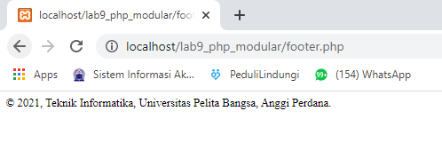

#### Membuat Home
Buat file baru dengan nama `home.php` dan masukan kode berikut.

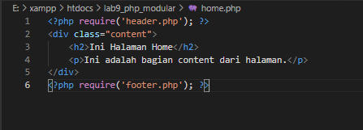

Kemudian untuk mengakses direktory tersebut pada web server dengan mengakses URL:
`http://localhost/lab9_php_modular/home.php`

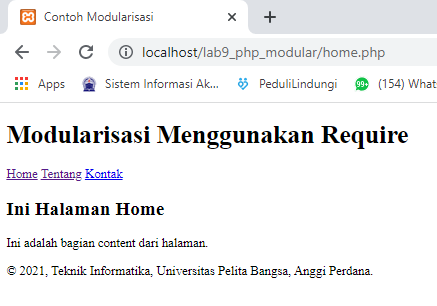

#### Membuat About
Buat file baru dengan nama `about.php` dan masukan kode berikut.

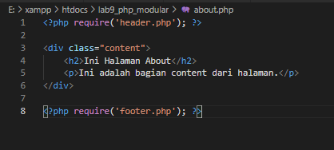

Kemudian untuk mengakses direktory tersebut pada web server dengan mengakses URL:
`http://localhost/lab9_php_modular/about.php`

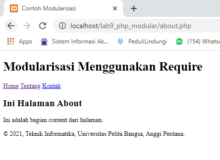

#### Membuat Kontak
Buat file baru dengan nama `kontak.php` dan masukan kode berikut.

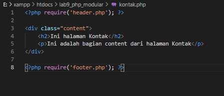

Kemudian untuk mengakses direktory tersebut pada web server dengan mengakses URL:
`http://localhost/lab9_php_modular/kontak.php`

### Pertanyaan dan Tugas
Implementasikan konsep modularisasi pada kode program praktikum 8 tentang
database, sehingga setiap halamannya memiliki template tampilan yang sama.

### Jawaban :
#### Menambahkan Header dan Footer pada Halaman Utama
Kita buka file `index.php` yang sebelumnya sudah kita buat pada praktikum 8.
Untuk menambahkan `header` pada file `index.php`, maka pada kodingan bagian atas, kita harus memasukan kodingan seperti berikut.

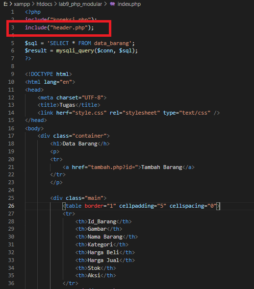

Kemudian untuk menambahkan `footer` pada file `index.php`, maka pada kodingan bagian paling bawah, kita harus memasukan kodingan seperti berikut.

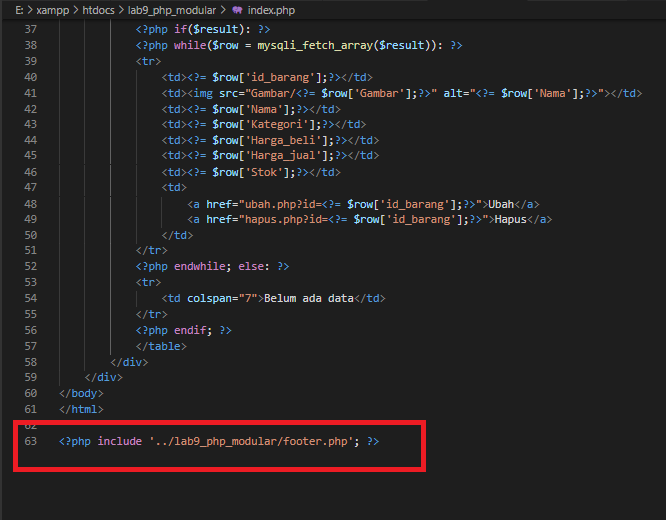

Kemudian untuk mengakses direktory tersebut pada web server dengan mengakses URL:
`http://localhost/lab9_php_modular/index.php`

Berikut hasil tampilan penambahan `header` dan `footer` pada webserver.

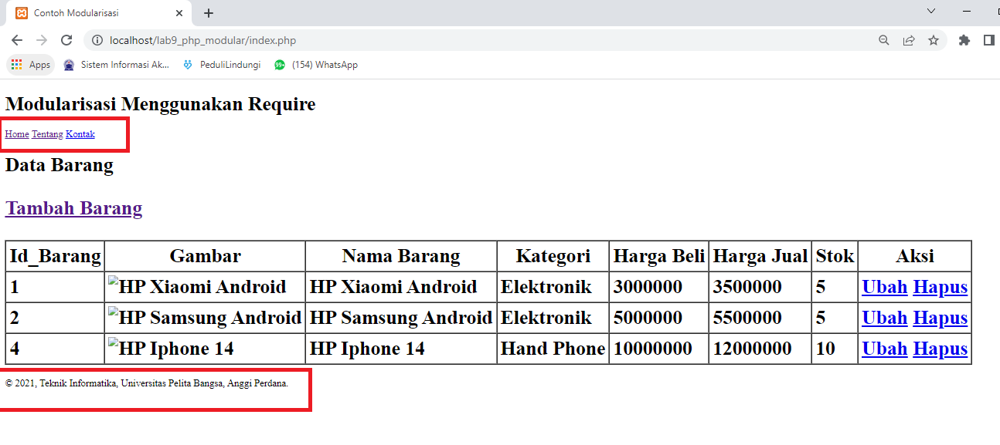

#### Menambahkan Header dan Footer pada Halaman Tambah Barang
Kita buka file `tambah.php` yang sebelumnya sudah kita buat pada praktikum 8.
Untuk menambahkan `header` pada file `tambah.php`, maka pada kodingan bagian atas, kita harus memasukan kodingan seperti berikut.

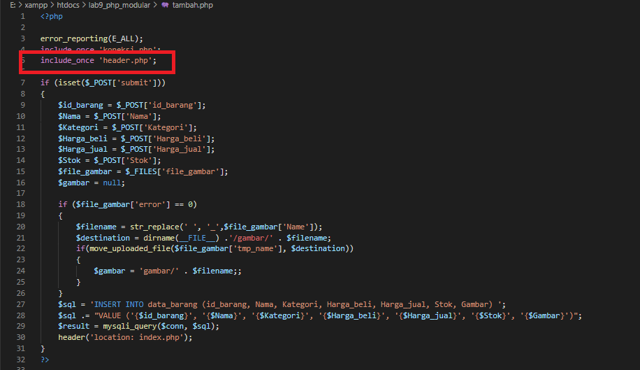

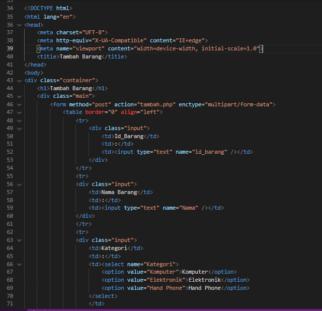

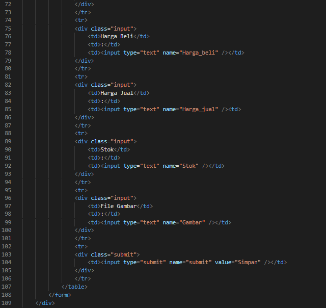

Kemudian untuk menambahkan `footer` pada file `tambah.php`, maka pada kodingan bagian paling bawah, kita harus memasukan kodingan seperti berikut.

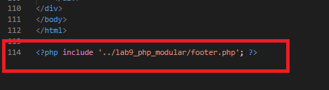

Kemudian untuk mengakses direktory tersebut pada web server dengan mengakses URL:
`http://localhost/lab9_php_modular/tambah.php`

#### ~~ Demikian latihan praktikum mengenai PHP Modular ~~